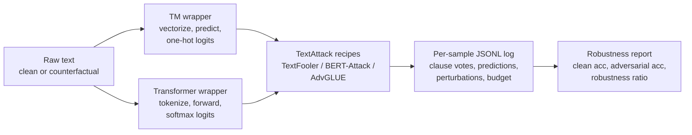
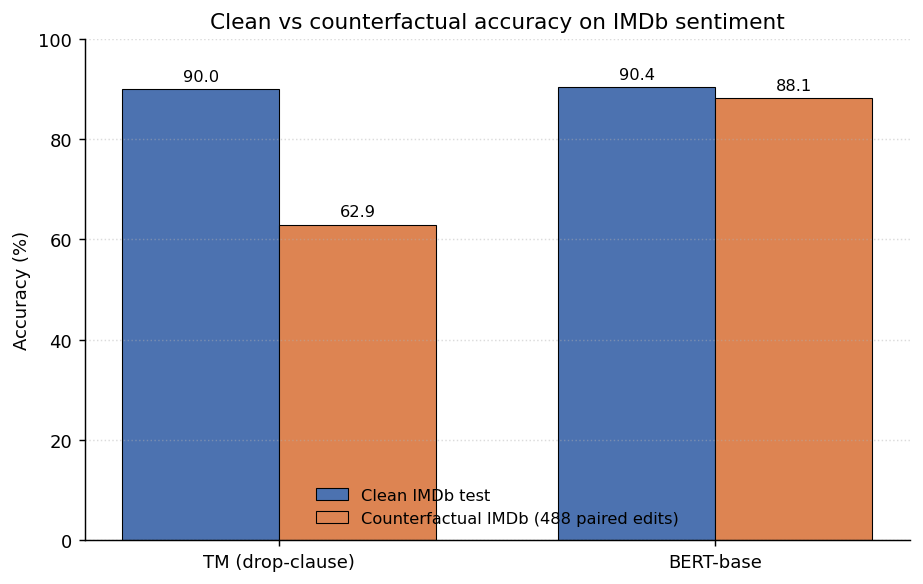

# Paper C: Robustness of Tsetlin Machines vs BERT under Adversarial Attack

> University of Agder (UiA)

**The idea of this project is the methodology, not the headline number.**
This repository provides a reusable pipeline for benchmarking *any* Tsetlin
Machine against *any* transformer under counterfactual and adversarial text
inputs. The IMDb results further down are a worked example produced by the
pipeline.

## The methodology

Tsetlin Machines and transformers do not naturally share an interface:
a TM expects a 0/1 feature vector and returns a hard label, while a
transformer expects raw text and returns a probability vector. Adversarial
attack libraries such as TextAttack only speak the transformer dialect.

The contribution of this repo is the **adapter and harness that put both
model families on the same attack pipeline**, with full per-sample logs:



Once a model fits the wrapper interface, every TextAttack recipe runs
against it unchanged. Swap the drop-clause TM for a coalesced TM or a
graph-feature TM, or swap BERT for RoBERTa, DeBERTa, or DistilBERT, and
the harness produces directly comparable numbers.

### What this gives any TM-vs-LLM study

1. **One attack interface for symbolic and neural models.**
   `src/robustness/tm_wrapper.py` exposes `__call__(texts) -> logits` so
   TextFooler, BERT-Attack, and AdvGLUE run unmodified on a TM.
2. **A counterfactual benchmark harness** that loads paired clean and
   human-edited inputs and pushes both models through them.
3. **Per-sample provenance logging** to `*.jsonl`: every aggregate number
   can be traced back to the individual samples, clause votes, and seed
   that produced it.

### Plug in your own models

```python
# Your own Tsetlin Machine:
from robustness.tm_wrapper import TMModelWrapper
from robustness.attack_runner import run_textfooler_attack

tm_wrapper = TMModelWrapper(my_tm, my_vectorizer, my_selector, n_classes=2)
results = run_textfooler_attack(tm_wrapper, my_dataset)

# Your own transformer (or any HuggingFace classifier):
from textattack.models.wrappers import HuggingFaceModelWrapper
llm_wrapper = HuggingFaceModelWrapper(my_model, my_tokenizer)
results = run_textfooler_attack(llm_wrapper, my_dataset)
```

The harness, the logs, and the metrics are identical for both.

## Worked example: IMDb sentiment

Both models are trained on standard IMDb, then evaluated on (a) the clean
IMDb test set and (b) the 488-sample Counterfactual IMDb test set from
Kaushik et al. (ICLR 2020).



| Setting | TM (drop-clause) | BERT-base |
|---|---|---|
| Clean IMDb test | 89.98% | 90.40% |
| Counterfactual IMDb (488 samples) | 62.91% | 88.11% |
| Robustness ratio (CF / clean) | 0.70 | 0.97 |

On counterfactual edits the TM loses about 27 points while BERT loses
about 2. The TM's failure mode is interpretable because each prediction
comes with the firing clauses; the gap suggests bag-of-words features
encode different invariants than transformer embeddings. Future work:
apply the same harness to the Subword-Dependency-Graph TM (Paper A's
architecture) to test whether richer features close the gap.

Full per-sample logs: `experiments/paper_c_imdb_tm/seed_42/log.jsonl`,
`experiments/paper_c_bert_imdb/seed_42/log.jsonl`.

## Repo layout

```
paper-c-tm-robustness/
|-- README.md, LICENSE, CITATION.cff, requirements.txt, MODELS.md, .gitignore
|-- src/
|   |-- robustness/{tm_wrapper.py, attack_runner.py, download_data.py}
|   |-- eval/{logger.py, stats.py}
|   `-- utils/load_bertgcn_splits.py
|-- experiments/
|   |-- train_paper_c_tm_imdb.py                # train + eval TM on IMDb
|   |-- eval_paper_c_bert_on_counterfactual.py  # eval BERT teacher on CF
|   |-- paper_c_imdb_tm/seed_42/
|   `-- paper_c_bert_imdb/seed_42/
|-- data/robustness/{imdb.json, counterfactual_imdb.json, advglue_sst2.json, sst2_info.json}
|-- figures/{make_results_plot.py, results.png}
|-- results/paper_c_imdb_robustness.json
`-- tests/
```

## Quickstart

```bash
pip install -r requirements.txt

# Reproduce TM on IMDb + counterfactual:
python experiments/train_paper_c_tm_imdb.py --seed 42

# Evaluate the BERT teacher on the same counterfactual split:
export BERT_MODEL_DIR=~/model_archive
python experiments/eval_paper_c_bert_on_counterfactual.py

# Regenerate the results figure:
python figures/make_results_plot.py
```

## Extension: Tsetlin family on canonical splits

The paper's worked example uses a single drop-clause TM on IMDb
bag-of-words. The robustness harness is model-agnostic, so the same
attack pipeline can drive any Tsetlin variant that exposes a
`predict_logits(texts) -> ndarray` surface. Three sibling-project
GraphTM students are wired up here:

| Student tag | Source project | Graph features | Tested on |
|---|---|---|---|
| `subword_dep` | `paper-a-subword-dep-graphtm/` | BPE subword nodes, typed dependency edges, sequential edges | R8, R52 |
| `bert_attention` | `paper-b-attention-distill-graphtm/` | BERT-base attention top-k edges (layers 6, 8, 10) | R8 |
| `qwen_attention` | `decoder-attention-distill-graphtm/` | Qwen2.5 attention top-k edges (mid-late layers) | R8 |

The integration code is in `src/robustness/students/`:

```
src/robustness/students/
|-- __init__.py                  # load_student(family, checkpoint_dir)
|-- base.py                      # GraphTMStudent contract
|-- subword_dep_graphtm.py       # Paper A loader
|-- bert_attention_graphtm.py    # Paper B loader
`-- qwen_attention_graphtm.py    # decoder-distill loader
```

Each loader returns an object that wraps a saved
`MultiClassGraphTsetlinMachine`, rebuilds graphs at inference time
using the sibling project's own `Graphs` helper (the subword-dep
builder for Paper A, the train-script `build_graphs` for Paper B, the
`src/graphs/builder.py` helper for the decoder distill project), and
exposes the same `predict_logits` contract as `TMModelWrapper`.

### Expected checkpoint layout

```
<checkpoint_dir>/
|-- tm_state.pkl     # pickle written by GraphTM.save(fname)
|-- vocab.json       # list[str], the training-time symbol vocabulary
|-- labels.json      # {"label_names": [...], "n_classes": int}
`-- config.json      # hyperparameters captured from the train script
```

The exact keys each loader reads from `config.json` are documented in
the loader docstring.

### Launch commands

```bash
# Paper A: subword + dependency GraphTM, R8, TextFooler
python experiments/run_robustness_extension.py \
    --student subword_dep --recipe textfooler --dataset R8 \
    --checkpoint ~/model_archive/paper_a_r8_seed42

# Paper A on R52
python experiments/run_robustness_extension.py \
    --student subword_dep --recipe textfooler --dataset R52 \
    --checkpoint ~/model_archive/paper_a_r52_seed42

# Paper B: BERT-attention GraphTM, R8, BERT-Attack
python experiments/run_robustness_extension.py \
    --student bert_attention --recipe bert_attack --dataset R8 \
    --checkpoint ~/model_archive/paper_b_r8_seed42

# Decoder distill: Qwen-attention GraphTM, R8, TextFooler
python experiments/run_robustness_extension.py \
    --student qwen_attention --recipe textfooler --dataset R8 \
    --checkpoint ~/model_archive/decoder_qwen_r8_seed42
```

Add `--dry_run` to verify the dataset loads and the student
instantiates without launching TextAttack.

### Result placeholders

The harness is wired and tested with mocks, but real attack runs need
both a GPU and saved students at hand. The cells below say
`not run (GPU pending)` so the methodology section can be reviewed
without fictitious numbers; they will be filled in when the GPU
becomes available.

| Student | Dataset | Recipe | Clean acc | Adv acc | Robustness ratio |
|---|---|---|---|---|---|
| `subword_dep` | R8 | TextFooler | not run (GPU pending) | not run (GPU pending) | not run (GPU pending) |
| `subword_dep` | R8 | BERT-Attack | not run (GPU pending) | not run (GPU pending) | not run (GPU pending) |
| `subword_dep` | R52 | TextFooler | not run (GPU pending) | not run (GPU pending) | not run (GPU pending) |
| `bert_attention` | R8 | TextFooler | not run (GPU pending) | not run (GPU pending) | not run (GPU pending) |
| `bert_attention` | R8 | BERT-Attack | not run (GPU pending) | not run (GPU pending) | not run (GPU pending) |
| `qwen_attention` | R8 | TextFooler | not run (GPU pending) | not run (GPU pending) | not run (GPU pending) |
| `qwen_attention` | R8 | BERT-Attack | not run (GPU pending) | not run (GPU pending) | not run (GPU pending) |

The wiring is covered by `tests/test_robustness_extension.py`, which
exercises each student through a deterministic mock GraphTM and locks
the `predict_logits` shape, dtype, and gradient-rejection contract.

## External dependencies

- **BERT IMDb teacher** (~4 GB). See [MODELS.md](MODELS.md). Reproducible
  from `bert-base-uncased` plus standard IMDb fine-tuning.
- **IMDb dataset**: pulled at runtime from HuggingFace datasets.
- **Counterfactual IMDb**: bundled as
  `data/robustness/counterfactual_imdb.json` (488 paired edits, originally
  from Kaushik et al., ICLR 2020).

## Citation

```bibtex
@misc{tm_robustness_2026,
  title  = {How Robust are Tsetlin Machines? An Adversarial Comparison with Fine-Tuned BERT on Counterfactual IMDb},
  author = {Anwar},
  year   = {2026},
  note   = {University of Agder}
}
```

## License

MIT. See [LICENSE](LICENSE).
